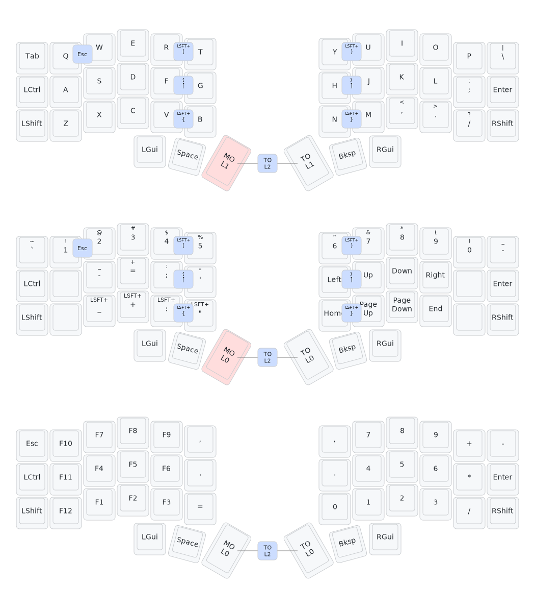

# Cygnus-Keymap

My cygnus keymap, 3x6 keys + 3 thumb keys.

  
  

## Layers

The keymap is based on the standard _**QWERTY**_ layout, which I am used to. Three layers are been created:

- L0: Alphabet keys and some keys around them (`ctrl`, `cmd`, `enter`, etc).
- L1: Symbol (`-`, `=`, `,`, `"`, etc), number (`1`-`9`) and navigation (`Up`, `Down`, `Left`, `Right`) keys around the alpha keys.
- L2: Function (`F1`-`F12`), numpad (`1`-`9`, `+`, `-`, `.`, etc) and other keys.

## Special Keys

There are 2 special keys to switch between different layers: `MO(x)` on the left thumb, `TO(x)` on the right thumb.

- To momentarily typing some symbols/numbers/etc, press `MO(x)` to switch to other layers, then release it to go back to default layer-0.
- To long time typing symbols/numbers/etc, press `TO(x)` to go to other layers and done the work, then press `TO(x)` to go back to default layer-0.

## Generate Keymap Layout

1. Create the keymap by [Vial](https://get.vial.today/), and save the keymap into the `Cygnus-Keymap.vil` file.
2. Use the [Vial layout to Keymap Drawer converter](https://yal-tools.github.io/vial-to-keymap-drawer/) to convert the `Cygnus-Keymap.vil` file to `Cygnus-Keymap.yml` file.
   - Set _**"Keyboard Kind"**_ as `splitkb/aurora/corne/rev1`.
   - Set _**"Layout Name"**_ as `LAYOUT_split_3x6_3`.
   - In _**"Keys out of order or too many keys?"**_ section, select "Omit -1 keys".
4. Copy the converted yml contents, and paste to the _**"Keymap YAML"**_ section of [Keymap Drawer](https://keymap-drawer.streamlit.app/), click the _**"Run"**_ button.
